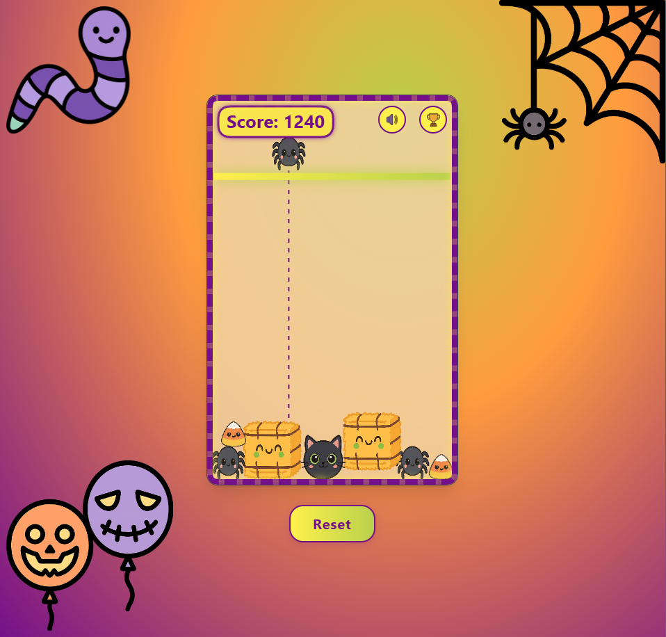

# Kitty Boo

**[Play it here →](https://didianca.github.io/kitty-boo/)**

A cute, Halloween-themed physics-based drop game. Guide spooky entities down and watch them bounce and stack. What's the highest score you can achieve?

## Stack

- **React** + **TypeScript**
- **Vite**
- **Tailwind CSS**
- **GitHub Copilot**
- **Cursor**

## Setup & Run

If you fork this repo and want to run it locally:

1. **Prerequisites:** Node.js (18+) and pnpm.
   ```bash
   npm i -g pnpm
   ```

2. **Install dependencies:**
   ```bash
   pnpm install
   ```

3. **Start the dev server:**
   ```bash
   pnpm dev
   ```

4. Open the URL shown in the terminal (usually `http://localhost:5173`).

## Credits

- **Color palette:** [Coolors](https://coolors.co/palette/ffffff-fff04c-ffc545-ff9b3e-ff7037-d15053-a3306f-75108b-110015-b8d14b)

## Gameplay


